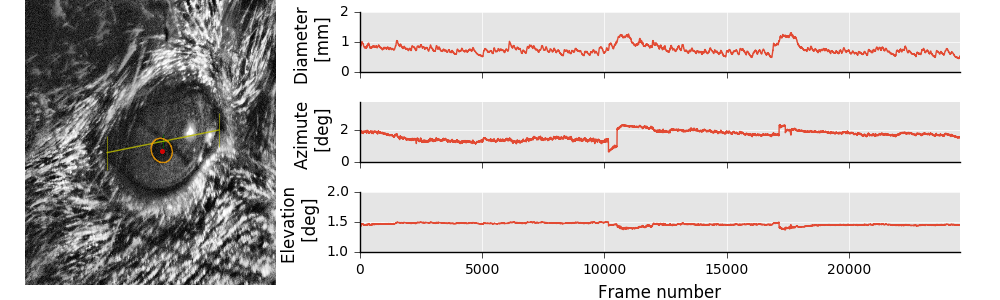

mOUSEpUPILtracker
================

A mouse pupil tracker using Python and OpenCV.

This can process 13 min of recording in around 4 minutes (on a common laptop), however there is a batch mode that uses MPI to launch frames on separate nodes/computers. OpenCV can be compiled to use the graphics card to speed up computations.

Note: Does not handle large pupil with reflection very well for now (like running in the dark).

Supported file formats:
-----------------------
   - Multipage TIFF sequence
   - Norpix seq files

Output file format:
-------------------

The output is an HDF5 file that can be read pretty much anywhere.

The file is organized as follows:

- **/diameter** - diameter of the pupil [in mm]
- **/azimuth** - azimuth of the pupil [in degrees]
- **/elevation** - elevation of the pupil [in degrees]
- */theta* - angle [in degrees]
- */ellipsePix* - ellipse parameters for each frame [in pixels] [short_axis,long_axis,a,b,phi]
- */positionPix* - position of the eye in pixels
- */crPix* - position of the corneal reflexion in pixels
- *points* - points marked by the user (left eye corner, top of the eye, right eye corner, bottom of the eye). These points mark the area to be analysed and define the scale.

In MATLAB do for example: `diam = h5read('filename.something','/diameter')`

Installation:
-------------
Dependencies (works with python 2.7 - because of the weave dependency the corneal deflection will not be detected using python 3.x, this will be fixed in the future):

- PyQt5
- opencv 3.0 (cv2)
- h5py
- PIMS (for reading norpix seq files)
- libtiff
- mpi4py (Not needed if ran on a single computer)
- weave (for tracking the corneal reflection - only python 2.7)

### Install instructions:

1. Get [ miniconda ](https://conda.io/miniconda.html) (I suggest Python 2.7 x64) 
2. ``conda install pyqt h5py mpi4py scipy numpy matplotlib``
3. ``conda install -c conda-forge tifffile weave`` - note that Weave requires python 2.7
4. ``conda install -c menpo opencv3``
5. ``pip install pims``
6. Clone the repositoty: ``git clone git@bitbucket.org:jpcouto/mptracker.git``
7. Go into that folder``cd mptracker`` and finally ``python setup.py develop``

**Note:** On windows I suggest getting the [ git bash terminal ](https://git-scm.com/downloads); weave might need aditional packages in windows like compilers and such...

**Note:** Weave is included on scipy 0.18. A simple way to know if weave is installed correctly is if you can see a red dot on the corneal reflection after having selected the eye region. 

Usage (GUI):
------------
Launch the GUI from the command line: ``mptracker-gui <filename>``. The filename is that of a seq file or one of the TIFF files in a TIFF sequence.  

**NOTE**: Do ``mptracker-gui --help`` for options.

### Command line options:

- *-o* <output file path> File where to save the results to (will ask if not specified).
- *--usetmp* use a temporary folder ("/tmp") in linux

### Instructions:

1.   Select left corner; top; right corner and bottom of the eye by clicking on the window.
2.   Adjust the parameters for best pupil contrast.
3.   Press the key *r* to launch the analysis. You will be prompted to save when it finishes. ( *r* stops analysis also). In the end you will be asked the output file unless you define one in the command line.
4.   Press the key *p* to plot results.

**Please let me know whether this works for you and acknowledge if you use it in a publication.**

**Joao Couto** - *jpcouto@gmail.com*

November 2016
